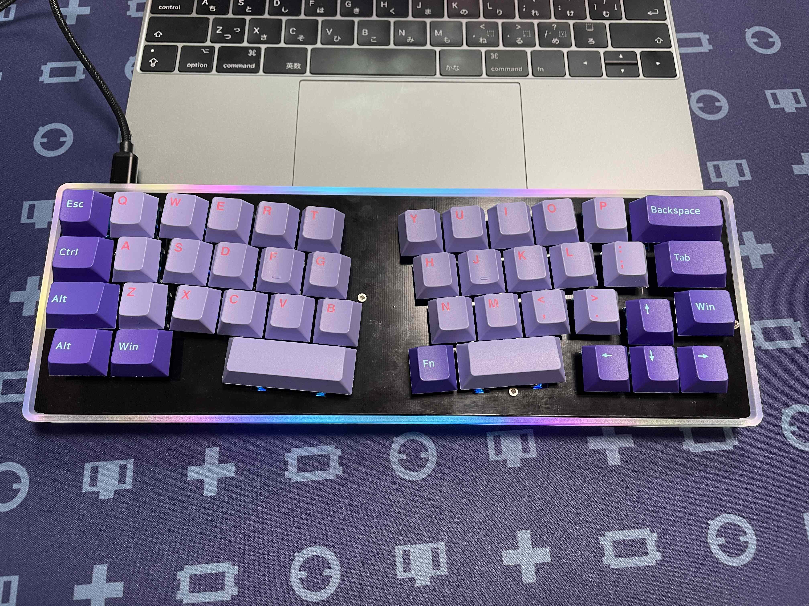

# cool844

## build guide
[こちら](https://github.com/telzo2000/cool844/blob/main/buildguideforcool844.md)です。 

## 設計に至るまで（Up to the design）
 
cool836Aにアクリルもしくはアルミでケースを作りたいと考えました。ただ、アクリルで作るとすれば、それは積層型になり、似たようなものをcool635で実践していました。他に、cool836Aの試作PCBを作ったときに、MDF材で積層型ケースを作っていました。同じことを繰り返すのはつまらないと思ったこと、話が変わりますが常用しているnomu30のrev.2であるリミテッドエディションを入手して、アルミケースのnomu30のかっこよさが印象にあって、「cool836Aもアルミケースにしてみたいな」という欲望が沸々と湧いていました。実際、nomu30の足元にも及ばないcool836Aですから、アルミケースを生産したら、破産でしょう。かといって、自分の分だけ生産するのも高価で、ちょっと難しい。そのとき、60％キーボードの汎用ケースが転用できるかなと思いつきました。それに合わせて、そのまま入れると、余白が多くなってしまうので、少しキーを増やすことでバランスが保てるかなと思い、デザインしました。cool836Aでやや広めにしたキーレイアウトを詰め直すなど修正しました。  
汎用ケースに合わせる際、いくつかの課題があることがわかりました。 
①汎用ケースのサイズがわかっていないこと、ネジ穴の位置が不明なこと。 
②pro microをどう取り扱うか。 
③マウントの方法。  
他にもあったかと思いますが、とりあえず、大きく３つの課題を解決する必要がありました。  

①については試しに購入すれば、わかるかなと思っていましたが、常にできるだけ少ない投資で開始することを信条としているので、サイズが知りたいだけで、DZ60やケース等を買うのは気が引けました。調べた後、普通に60%キーボードとして使えばいいという考えもありますが、私は30％や40％キーボードを常用していると、60％キーボードを新しく購入する必要性を感じません。実際、いくつか60％キーボードのGBに参加しているので、これ以上、使わないだろうDZ60のキーボードを購入するのは避けたい事情がありました。ただ、出来上がった基板のため、「ケースだけは買おう」と思い、安価なクリアケースを購入しました。サイズは、結局、インターネット上に上がっている図を見て、そこの数値を参考にkicadで設計しました。kicadで設計したら、実寸で印刷して切り取り、それをクリアケースにはめ込んで、ネジ穴の位置を確認しました。  

②については、kicadで設計が始まって、途中までは、MCU等の直付けで作るため、並行して行っていました。実際に半田付けができるかどうか、検討した結果、MCU直付けで作る案を凍結しました。PCBAができるのであれば、いいのですが、cool836Aの余興で作る自作キーボードに、そこまでお金をかけられません。余剰のPCBを頒布することも考えて、取り扱いが簡単なpro microを採用して作ることができないか考えました。結論から言うと、pro microをそのまま取り付ける場合、ケースの改造が必要でした。または、キーレイアウトの大きな見直し、一番左側にpro micro設置する空間を確保しなくてはいけません。デザイン上、かっこよくないと思いました。次に、pro microを任意の場所に設置して、ケーブルを引き込むことを考えました。これは、ケースにある端子差し込み口が小さく、ケーブルが入らないことで無理とわかりました。おれも、ケースを改造すれば、できるかもしれません。しかし、それは目指した方向とは違います。参考になったのが、pekaso氏の「BUILD YOUR OWN KEYBOARDs [compiled+]」に載っていたFortitude60の構造でした。インターネットでビルドガイドも参考にして、pro microからマイクロUSBオス端子とケーブルとUSB-Cメス端子を繋ぐドーターボード（この表現でよいのでしょうか）を使うことを思いつきました。これにより、pro microは任意の位置で、ケースの端子はUSB-Cで対応できるとイメージが湧きました。秋月電子からネット通販で必要な部品を取り寄せて、作ったところ、うまくいきました。部品が届いた日に、偶然、pekaso氏がpro microマイクロUSBメス端子を取り外して、ケーブルとUSB-Cメス端子を繋いだツイートを出されたとき、「おお！」と唸りました。
  

③については、汎用ケースを一つ購入しました。スイッチプレートから１５mmネジを10mmスペーサーを通して、そのままケースのネジ穴に貫通する方法でマウントすることとしました。その際、全てのねじ穴が使えないことがわかりました。右上にあるねじ穴の位置は、ちょうどキーに接触してしまい、調整を重ねましたが、難しいと判断しました。そのネジ穴を使わなくても、固定することは難しくなかったので、５箇所のねじ穴を利用して、スイッチプレートをマウントする方法を取りました。打鍵感や打鍵音にどのような影響があるかまでは、検証できません。そこまでこだわるのであれば、次の段階です。今回の主目的は、汎用ケースを利用して、Alice配列のキーボードを作ることです。この一年、国内外で40％のAlice配列の自作キーボードがいくつかGBされています。cool836Aを作ったこともあり、購入するには至りませんでした。少し時間が経ってみると、欲しかったのかなと言う気持ちが湧いてきました。まあ、そうなると、自分で作ればいいかなと思うのが、まずいところです。実際に、このように作ってしまいました。 
完成したところ、思った以上に、評判が良く、これまでのキーボードの中で一番売れました。ありがとうございます。 
 
令和３年８月11日追記 
Pro microの装着の向きから、一部の汎用ケース底面との干渉があることがわかり、V2版（ver.2.xx）の設計をする。V2版はPro microの装着事態を見直した。PCBの一部をくりぬき、そこにはまるようにPro microを装着する。薄さを追求できる。ただし、この方法では、マック８コンスル－（スプリングピンヘッダ）が使えない弊害もある。V2版は7月末に発注した。 
V2版とは別に、Pro microの設置場所を変更したver.1.2を設計したver.1.2は、Pro microの設置場所を２箇所から選択できるようにした。 
 
# 発注ガーバーファイル名
Ver.1　gbrcool844date20210222.zip 
Ver.1.1 gbrcool844date20210415.zip 
Ver.1.2 gbrcool844date20210810.zip 
# 今後の変更予定（Update Plan)

☑︎板バネ機構搭載　Ver.1.1で実装 
□外付けマクロパッド　※cool844とは別のものになる可能性あり。 
