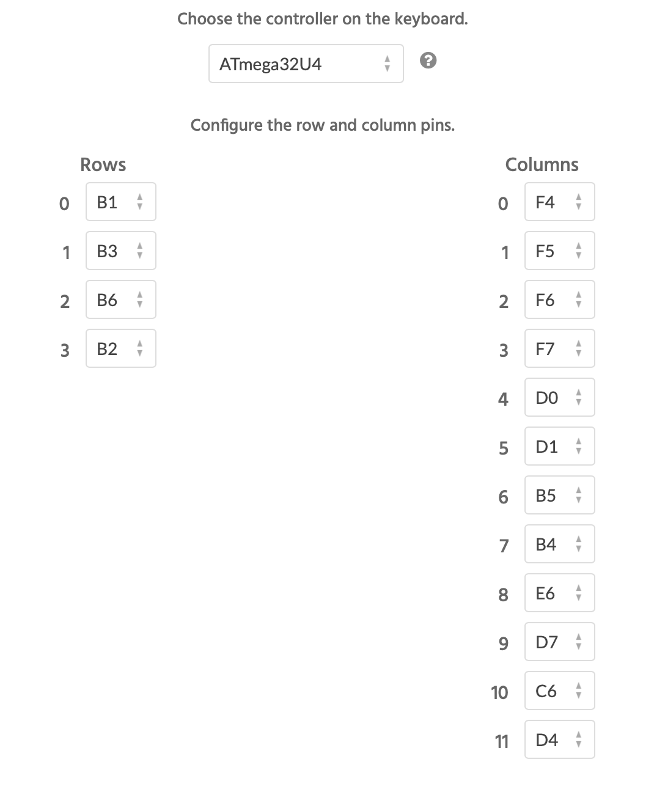
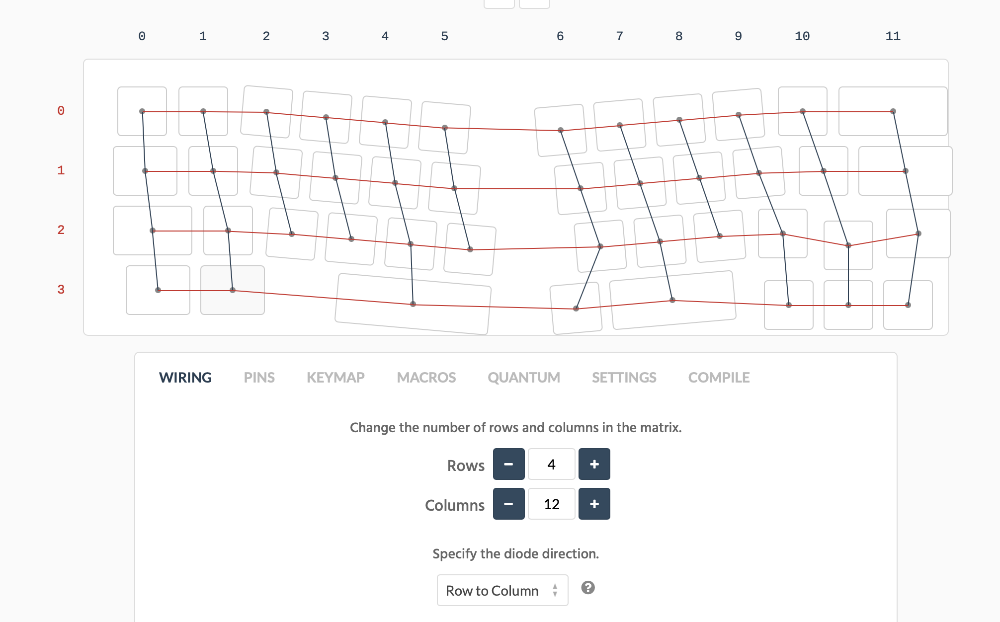
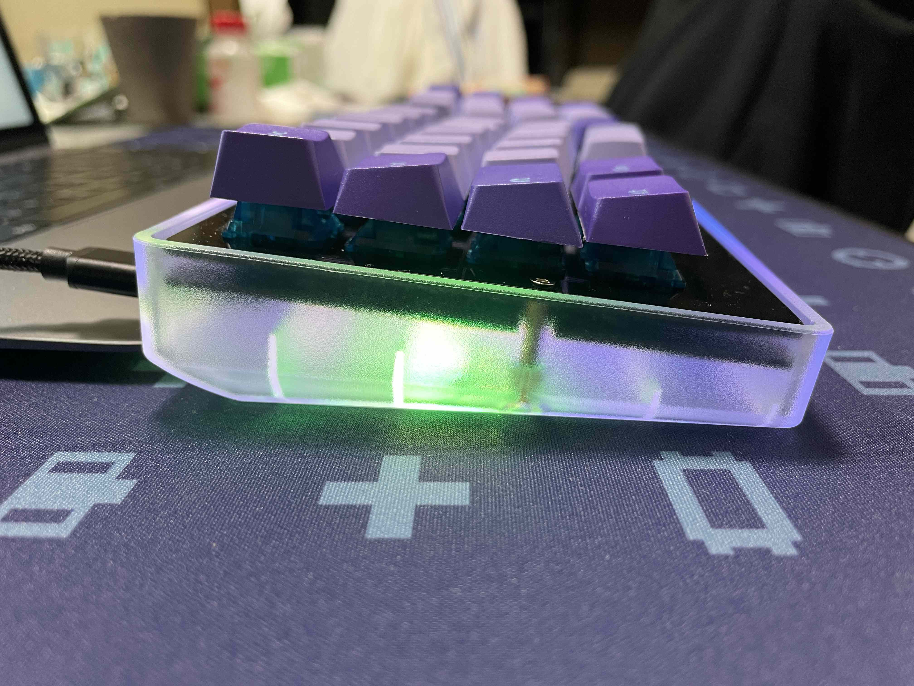

# cool844ビルドガイド

## ◯同封されているもの

スイッチプレート　１枚 
PCB １枚 

## ◯別途に購入するもの（１）
M2スペーサー10mm 5個 
M2ネジ15mm 5本 
ウレタンケーブル25cm 
ダイオード　44本 
MXソケット　44個 
タクトスイッチ　1個 
キースイッチ　44個 
キーキャップ 
スタビライザー２U ３個 
pro micro １個 
スプリングピンヘッダ（マックエイトコンスルー）２個 
フルカラーシリアルLEDテープ　２枚 
※これらのものについては、[遊舎工房](https://shop.yushakobo.jp)、[TALP KEYBOARDs](https://talpkeyboard.stores.jp)、[KOCHI KEYBOARD](https://kochikeyboard.stores.jp)等国内で自作キーボードに関する部品等を取り扱っているお店で購入することができます。M2スペーサー10mmは、外径の小さいものが最適です[KOCHI KEYBOARD](https://kochikeyboard.stores.jp)で[取り扱っているもの](https://kochikeyboard.stores.jp/items/5f8aabbdd24eee436e27e967)を推奨します。
 

## ◯別途に購入するもの（２）
[マイクロUSB端子（オス）](https://akizukidenshi.com/catalog/g/gC-07666/) 
[USB タイプC基板](https://akizukidenshi.com/catalog/g/gK-15426/) 
※これらのものについては、[秋月電子通商](https://akizukidenshi.com/catalog/)で購入することができます。

## ◯別途に購入するもの（3）
ケース
※GH60系60％キーボードケースを使うことを前提になっています。国内では[遊舎工房](https://shop.yushakobo.jp)等で、海外では[Ali Expresse](https://best.aliexpress.com/)等で同じようなケースを材質ごとに、見つけることができます。cool844がケース全てに使えるか確認することは、個人の裁量を超えます。購入者の自己責任でお願いします。

## ◯ファームウェア
 　このキーボードはQMKというキーボード用のソフトウェアで動作するようにプログラミングしています。 
　作者が非IT系であることから、自力でファームウェアを作成していません。[Keyboard Firmware builder](https://kbfirmware.com/)を利用して、hexファイルを作成しました。[QMK Configurator](https://config.qmk.fm/#/)にプルリクする等すれば、QMKConfiguratorを使用してキーレイアウトを変更できますが、作者には、その力がありません。有識者の方で出来る方がいらっしゃれば、よろしくお願いします。 
　（もし、出来ましたら、ご連絡いただけると、ビルドガイドに、そのことを記載したいと思います） 
ピンの情報は次の通りです。 

　ここでは、Keyboard Firmware Builderで作成した [デフォルトJsonファイル](https://github.com/telzo2000/cool844)と[デフォルトHexファイル](https://github.com/telzo2000/cool844)を下記のリンク先に置きます。ダウンロードして、QMK Toolboxにて使用してください。QMK Toolboxは下記のリンク先にあります。 
　[QMK Toolbox](https://github.com/qmk/qmk_toolbox/releases)
 
　[デフォルトhexファイル](https://github.com/telzo2000/cool844)
 
　[デフォルトJsonファイル](https://github.com/telzo2000/cool844)
　 
　QMK Toolboxの使い方は詳しく書きませんが、デフォルトhexファイルをダウンロードして、「Local File」で選択してください。pro microをPCに接続し、リセットボタンを押して書き込みます。（リセットボタンをダブルクリックしないと書き込めないパターンのものもあります） 
　書き込み方法などは[サリチル酸さんの（初心者編）自作キーボードにファームウェアを書き込むの記事](https://salicylic-acid3.hatenablog.com/entry/qmk-configurator)がとても参考になります。他にも有用な記事が多いので、一読することをお勧めします。 
　デフォルトキーマップは作者が実際に使用しているもので、ほぼ何不自由なく使えるように工夫しています。チートシートは次のとおりです。 
Layer=0 

 
Layer=1 

 
Layer=2 

 
Layer=3 

 
　キーレイアウトの変更をされる場合は、事前に、[デフォルトJsonファイル](https://github.com/telzo2000/cool844)をダウンロードしてから、[Keyboard Firmware builder](https://kbfirmware.com/)へアクセスしてください。「Upload」をクリックして、先ほどのデフォルトJsonファイルを選択してください。下の画面になりましたら、「KEYMAP」をクリックしてください。その画面でキーレイアウトの変更ができます。 

 
　（「WIRING」「PINS」は絶対に変更しないでください。ここを変更して作成したHexファイルでは正しくキーが入力されなくなります。）変更ができましたら、「SETTING」をクリックしてください。下の画面になりましたら、「Save Configuration」をクリックしてください。変更されたキーレイアウトのJsonファイルがダウンロードされます。次回以降、それを使うことで、変更履歴を意識しながら、最高のキーレイアウトへ到着できると思います。 

 
　続いて、「COMPILE」をクリックしてください。下の画面になりましたら、「Download .hex」をクリックしてください。変更されたキーレアウトのHexフィルがダウンロードされます。このHexファイルを前述のQMK Toolboxで使用してください。 

 
 

## ◯組み立て

### １　表裏面の確認
スイッチプレートは、表面の右上にcool 844と印字されています。PCB は、diode 、socketと印字されている面が裏面です。

### ２　ダイオードのハンダ付け
PCB 裏面にダイオードのハンダ付けをします。画像を参考にダイオードの向きに注意しながらハンダ付けをしてください。１箇所印字されていないミスが確認できています。それ以外のダイオードのハンダ付けを参考にして、ハンダ付けをしてください。

### ３　MXソケットのハンダ付け
PCB 裏面にMXソケットのハンダ付けをします。PCB 裏面の端子箇所に多めにフラックスを塗布して、予備ハンダをしてください。MXソケットをsocket と印字を隠すように置いて、ハンダゴテを当てて、予備ハンダを溶かしながら、ハンダ付けをしてください。

### ４　タクトスイッチの取り付け
PCB裏面にresetと書かれた箇所があります。そこにタクトスイッチをハンダ付けしてください。

### ５　pro microの取り付け 
　本製品ではコンスルー（スプリングピンヘッダ）を使用してのpro microの装着を推奨しています。コンスルー（スプリングピンヘッダ）の向きに気をつけて使用してください。画像を参考にして、pro microの向きに注意してください。 
pro microを装着したさ、pro microの基板がたくさん載っている側が下向きになります。cool836AのVer.C+（イエローバージョン）と同じ付け方になります。

### ６ ドーターボードの作成と取り付け
ドーターボードの作成は[こちら](https://github.com/telzo2000/Hello_keyboard/blob/main/dbforcool844/buildlog.md)になります。取り付け方は、次の画像（試作品）を参考にしてください。 

### ７　スタビライザーの取り付け
PCB表面３箇所に、２Uのスタビライザーを取り付けます。スタビライザーに事前に、ルブしておくことをお勧めします。

### ８　キースイッチの取り付け 
最初にキースイッチ５個をトッププレートの５箇所（四隅と一番手前）に差し込みます。一度に全部のキースイッチを取り付けて、その後にPCBにハンダ付けしたMXソケットに差し込むとうまくいかないことが予想されます。５箇所で一度PCBにハンダ付けしたMXソケットに差し込み、残りのキースイッチをトッププレート、PCBの順に差し込んでください。それぞれのキースイッチの足がきちんとMXソケットの基板の穴に差し込まれていることを確認してください。差し込むときに、足が曲がってしまうことがあります。その場合は、ボタンを押しても入力されません。一度キースイッチを外して、足の修正または新しいキースイッチに交換等対処してください。

### 9 フルカラーシリアルLEDテープの取り付け
PCB裏面に、テープの裏面の保護紙を剥がして貼り付けます。その後、それぞれの端子にハンダを山盛りにして導通させてください。

この後、ファームウェアを入れて、入力できるかテストをしてください。

### 10　ネジ、スペーサーの取り付け
スイッチプレート表面からネジを通して、スペーサーも通しておきます。５箇所全て、その状態にします。 
ケースにスイッチプレート等を差し込んで、ネジを締めます。締めたり、緩めたりを繰り返すうちに、ネジ山が上手に溝に入り込んで、締めることができます。プラスチック製ケースではスイッチプレートがケース壁面上部より１mm程度下がった位置で、ネジは締まりました。締めすぎて、ネジ山を壊さないよう、注意してください。

